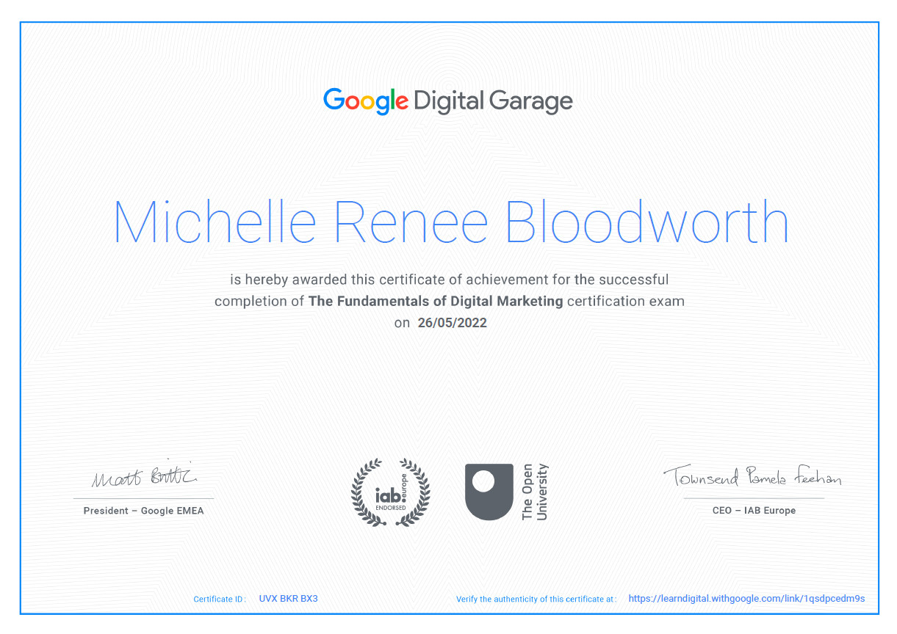
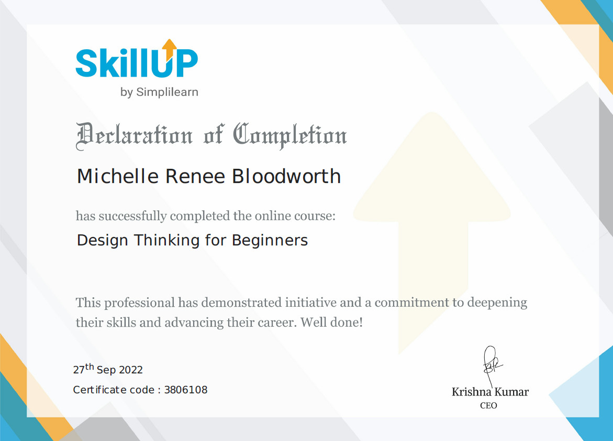
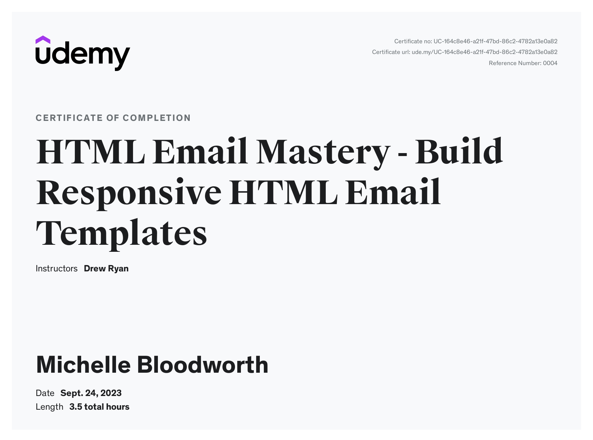
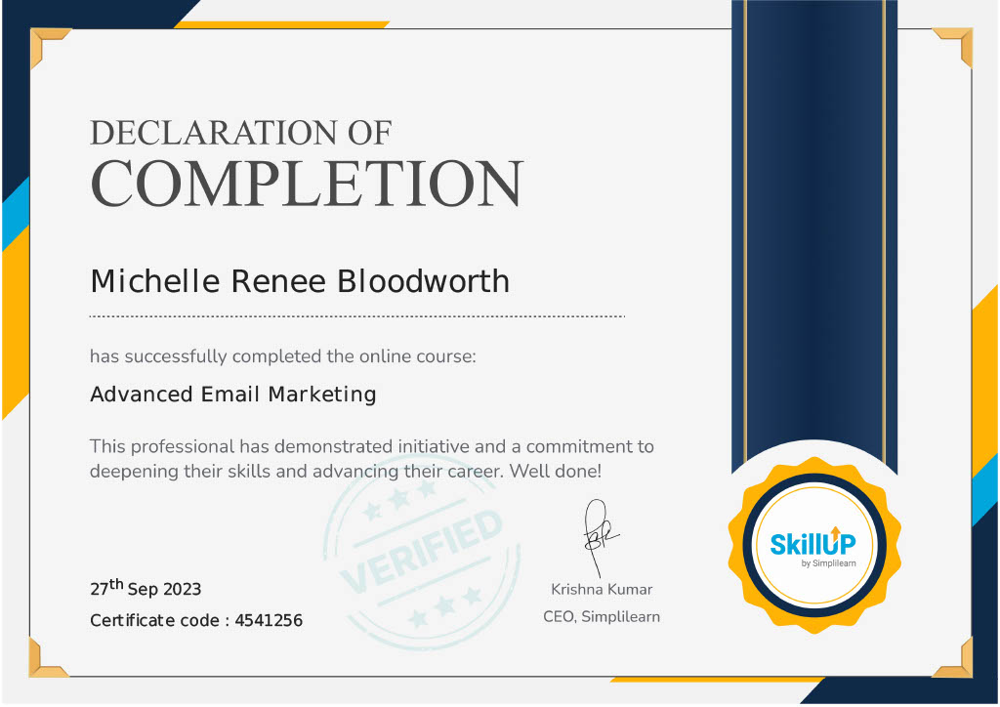
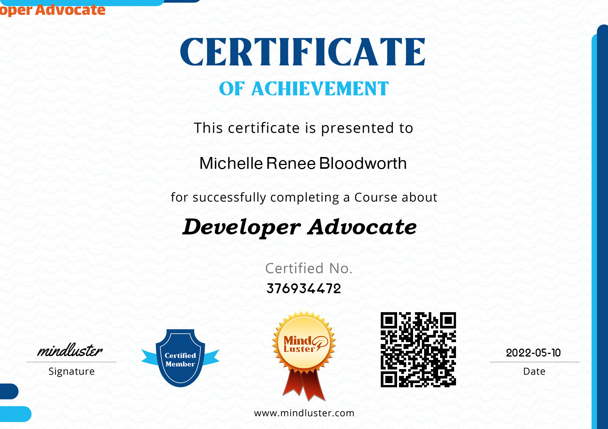

# Table of Contents

- [My Certifications](#my-certifications)
- [Screenshots](#screenshots)
- [Author](#author)
- [Acknowledgments](#acknowledgments)

## My Certifications

These are my current certifications:

- Digital Marketing
- Design Thinking
- HTML Email Development
- Advanced Email Marketing
- Developer Advocate
- Git

### Screenshots

- [Digital Marketing Certificate Verification Web Link](https://learndigital.withgoogle.com/digitalgarage/validate-certificate-code)
- Certificate ID #: UVX BKR BX3

- [Design Thinking Certificate Verification Web Link](https://www.simplilearn.com/skillup-certificate-landing?token=eyJjb3Vyc2VfaWQiOiIxNzgwIiwiY2VydGlmaWNhdGVfdXJsIjoiaHR0cHM6XC9cL2NlcnRpZmljYXRlcy5zaW1wbGljZG4ubmV0XC9zaGFyZVwvdGh1bWJfMzgwNjEwOF8xNjY0MjIyNDA3LnBuZyIsInVzZXJuYW1lIjoiTWljaGVsbGUgUmVuZWUgQmxvb2R3b3J0aCJ9&utm_source=shared-certificate&utm_medium=lms&utm_campaign=shared-certificate-promotion&referrer=https%3A%2F%2Flms.simplilearn.com%2Fcourses%2F4299%2FDesign-Thinking-for-Beginners%2Fcertificate%2Fdownload-skillup&%24web_only=true&_branch_match_id=970406155640884889&_branch_referrer=H4sIAAAAAAAAA8soKSkottLXL87MLcjJ1EssKNDLyczL1k%2FVrwo190kMTTRzKUkCANsQARMlAAAA)
- Certificate ID #: 3806108

- [HTML Email Development Certification Web Link](https://www.udemy.com/certificate/UC-164c8e46-a21f-47bd-86c2-4782a13e0a82/)
- Certificate ID#: UC-164c8e46-a21f-47bd-86c2-4782a13e0a82
- Reference No. 0004

- [Advanced Email Marketing certification Web Link](https://www.simplilearn.com/skillup-certificate-landing?token=eyJjb3Vyc2VfaWQiOiI2MDAiLCJjZXJ0aWZpY2F0ZV91cmwiOiJodHRwczpcL1wvY2VydGlmaWNhdGVzLnNpbXBsaWNkbi5uZXRcL3NoYXJlXC90aHVtYl80NTQxMjU2XzE2OTU4Mzc2NjAucG5nIiwidXNlcm5hbWUiOiJNaWNoZWxsZSBSZW5lZSBCbG9vZHdvcnRoIn0%3D&utm_source=shared-certificate&utm_medium=lms&utm_campaign=shared-certificate-promotion&referrer=https%3A%2F%2Flms.simplilearn.com%2Fcourses%2F2515%2FAdvanced-Email-Marketing%2Fcertificate%2Fdownload-skillup&%24web_only=true&_branch_match_id=940039034441098149&_branch_referrer=H4sIAAAAAAAAA8soKSkottLXL87MLcjJ1EssKNDLyczL1k%2FVLzQ0jjAKdyoockkCAI3yetUlAAAA)
- Certificate ID#: 4541256

- [Developer Advocate Certificate Verification Web Link](https://www.mindluster.com/student/certificate/376934472)
- Certificate ID #: 376934472

- [Git and GitHub Certificate Verification Web Link](https://www.udemy.com/certificate/UC-6d43caf5-24f3-4e73-a268-4b5af4a4c3b2/)
- Certificate ID #: UC-6d43caf5-24f3-4e73-a268-4b5af4a4c3b2
- Reference No. 0004

## Author

Michelle Renee "Slim" Bloodworth is an experienced, self-taught client-side UI Developer and Designer, content writer, former stand-up comic and former bartender with a background in education.

- Website - [michellerenee.dev](https://michellerenee.dev)
- Facebook - [Creative Software Solutions](https://www.facebook.com/profile.php?id=100073842390690)
- CodePen - [@slimbloodworth](https://codepen.io/slimbloodworth)
- LinkedIn - [Michelle Renee](https://www.linkedin.com/in/michelle-renee-99b455187/)
- GitHub - [@slimbloodworth](https://github.com/SlimBloodworth)

## Acknowledgments

Google Learn, Simplilearn, Udemy all have been very wonderful resources for education and certifications, and a great way to skillup.
